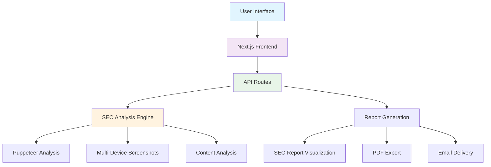

<div align="center">

# ⚡ **SEO Expert — SEO Audit Report Generator**

**A modern web solution that provides comprehensive SEO audits, performance analysis, security assessments, and actionable recommendations to optimize your website's search engine visibility and overall digital presence.**

---


[](https://nextjs.org/)
[](https://www.typescriptlang.org/)
[](https://reactjs.org/)
[](https://tailwindcss.com/)
[](https://developers.google.com/web/tools/lighthouse)
[](https://pptr.dev/)

[](https://opensource.org/licenses/MIT)
[](http://makeapullrequest.com)


</div>

---

## 🎯 **What is SEO Expert?**

**SEO Expert** SEO Expert is a modern web application designed to revolutionize how businesses approach search engine optimization. Built with cutting-edge web technologies, this platform provides comprehensive website analysis that goes beyond basic SEO checks, incorporating advanced security assessments and privacy-first practices.

### **🌟 Core Purpose**
Transform your website's performance with data-driven insights that matter. Our platform analyzes your website across multiple dimensions - from technical SEO fundamentals and security vulnerabilities to user experience optimization - delivering actionable recommendations that drive real results while maintaining the highest standards of data protection and privacy.

### **🎯 Target Audience**
- **Digital Marketing Agencies** - Streamline client reporting and analysis
- **Web Developers** - Integrate SEO best practices into development workflow  
- **Business Owners** - Understand and improve online presence
- **SEO Professionals** - Access advanced analytics and reporting tools
- **Content Creators** - Optimize content for better search visibility

---

## 📋 **Table of Contents**

<details>
<summary>Click to expand navigation</summary>

- [🎯 What is SEO Expert?](#-what-is-seo-expert)
- [✨ Key Features](#-key-features)
- [🏗️ Architecture](#️-architecture)
- [🛠️ Technology Stack](#️-technology-stack)
- [🚀 Quick Start Guide](#-quick-start-guide)
- [📖 Usage & Examples](#-usage--examples)
- [🔧 Configuration](#-configuration)
- [🌐 API Documentation](#-api-documentation)
- [📁 Project Structure](#-project-structure)
- [🚢 Deployment](#-deployment)
- [🤝 Contributing](#-contributing)
- [📊 Performance Metrics](#-performance-metrics)
- [🔒 Security & Privacy](#-security--privacy)
- [📄 License](#-license)
- [🙏 Acknowledgments](#-acknowledgments)

</details>

---

## ✨ **Key Features**

<table>
<tr>
<td width="50%">

### 🔍 **Advanced SEO Analysis**
- **Technical SEO Audit** - Meta tags, headers, schema markup
- **Core Web Vitals** - Simulated LCP, FID, CLS performance metrics
- **Mobile Optimization** - Responsive design analysis
- **Content Quality** - Keyword density, readability scores
- **Comprehensive Security Assessment** - HTTPS, security headers, SSL/TLS validation, vulnerability scanning
- **Accessibility Check** - WCAG compliance evaluation
- **Privacy & Data Protection** - GDPR compliance analysis, cookie policy validation

</td>
<td width="50%">

### 📊 **Intelligent Reporting**
- **Interactive Dashboard** - Real-time visual analytics
- **PDF Report Generation** - Professional downloadable reports
- **Screenshot Capture** - Desktop, tablet & mobile visual comparisons
- **Historical Tracking** - Performance trend analysis
- **Custom Branding** - White-label report options
- **Multi-language Support** - Internationalization ready

</td>
</tr>
<tr>
<td width="50%">

### 🤖 **Data-Driven Insights**
- **Smart Recommendations** - Prioritized action items
- **Competitive Analysis** - Industry benchmarking
- **Technical Issue Detection** - Automated problem identification
- **ROI Calculation** - Impact estimation for improvements
- **Backlink Analysis** - Domain authority evaluation
- **Social Signals** - Social media integration

</td>
<td width="50%">

### 🎨 **Modern User Experience**
- **Responsive Design** - Seamless cross-device experience
- **Dark/Light Themes** - Customizable interface preferences
- **Real-time Updates** - Live audit progress tracking
- **Accessibility First** - WCAG 2.1 AA compliant
- **Progressive Web App** - Offline capability support
- **Fast Loading** - Optimized for performance

</td>
</tr>
</table>

---

## 🏗️ **Architecture**

<div align="center">



</div>

### **🔄 Data Flow**
1. **Input Processing** - URL validation and preprocessing
2. **Multi-threaded Analysis** - Parallel execution of audit components
3. **Data Aggregation** - Consolidation of analysis results
4. **Report Generation** - Dynamic PDF and visual report creation
5. **Delivery System** - Email distribution and download options

---

## 🛠️ **Technology Stack**

<div align="center">

### **Frontend Technologies**
| Technology | Version | Purpose |
|------------|---------|---------|
|  | `^14.0.0` | React framework with App Router |
|  | `^5.0.0` | Type-safe development |
|  | `^18.0.0` | UI component library |
|  | `^3.3.0` | Utility-first CSS framework |

### **Backend & Analysis**
| Technology | Version | Purpose |
|------------|---------|---------|
|  | `^21.0.0` | Browser automation & screenshots |
|  | `^11.0.0` | Performance & SEO auditing |
|  | `^20.0.0` | Runtime environment |
|  | `^1.0.0` | Server-side HTML parsing |
|  | `^1.11.0` | HTTP client |

### **UI & Visualization**
| Technology | Version | Purpose |
|------------|---------|---------|
|  | `Latest` | Component library |
|  | `^10.16.16` | Animation library |
|  | `^4.4.0` | Data visualization |
|  | `^0.294.0` | Icon library |

</div>

---

## 🚀 **Quick Start Guide**

### **📋 Prerequisites**

Before you begin, ensure you have the following installed:

```bash
# Check Node.js version (required: 18.0+)
node --version

# Check npm version
npm --version

# Check Git version
git --version
```

### **⚡ Installation**

<details>
<summary><strong>Step 1: Clone Repository</strong></summary>

```bash
# Clone the repository
git clone https://github.com/your-username/seo-expert.git

# Navigate to project directory
cd seo-expert

# Verify project structure
ls -la
```

</details>

<details>
<summary><strong>Step 2: Install Dependencies</strong></summary>

```bash
# Install with npm (recommended)
npm install

# Or with yarn
yarn install

# Or with pnpm (fastest)
pnpm install

# Verify installation
npm list --depth=0
```

</details>

<details>
<summary><strong>Step 3: Environment Configuration</strong></summary>

```bash
# Copy environment template
cp .env.example .env.local

# Edit environment variables
nano .env.local
```

**Required Environment Variables:**
```env
# Email Configuration (Required for contact form)
EMAIL_USER=your-email@gmail.com
EMAIL_PASS=your-gmail-app-password
```

</details>

<details>
<summary><strong>Step 4: Launch Development Server</strong></summary>

```bash
# Start development server
npm run dev

# Or with custom port
npm run dev -- --port 3001

```

**Expected Output:**
```
✓ Ready in 2.3s
✓ Local:    http://localhost:3000
✓ Network:  http://192.168.1.100:3000
```

</details>

### **🎉 Verification**

Open your browser and navigate to [http://localhost:3000](http://localhost:3000). You should see the SEO Expert homepage with:

- ✅ Responsive navigation header
- ✅ Hero section with audit form
- ✅ Feature showcase
- ✅ Footer with links

---

## 📖 **Usage & Examples**

### **🔍 Basic SEO Audit**

<details>
<summary><strong>Web Interface Usage</strong></summary>

1. **Navigate to Homepage**
   ```
   http://localhost:3000
   ```

2. **Enter Website Details**
   - **URL**: `https://example.com`
   - **Email**: `your-email@domain.com`
   - **Options**: Select audit depth (Basic/Advanced)

3. **Initiate Audit**
   - Click "Generate SEO Report"
   - Monitor real-time progress
   - Wait for completion (typically 30-60 seconds)

4. **Review Results**
   - Interactive dashboard with scores
   - Detailed recommendations
   - Download PDF report
   - Share results via email

</details>

<details>
<summary><strong>API Integration Example</strong></summary>

```javascript
// Basic audit request
const auditWebsite = async (url, email) => {
  try {
    const response = await fetch('/api/audit', {
      method: 'POST',
      headers: {
        'Content-Type': 'application/json',
      },
      body: JSON.stringify({
        url: url,
        email: email,
        options: {
          includeScreenshots: true,
          mobileAnalysis: true,
          performanceAnalysis: true
        }
      })
    });

    const result = await response.json();
    
    if (result.success) {
      console.log('Audit completed:', result.report);
      return result.report;
    } else {
      throw new Error(result.error);
    }
  } catch (error) {
    console.error('Audit failed:', error);
    throw error;
  }
};

// Usage
auditWebsite('https://example.com', 'user@example.com')
  .then(results => {
    console.log('SEO Score:', results.overallScore);
    console.log('Recommendations:', results.recommendations);
  })
  .catch(error => {
    console.error('Error:', error);
  });
```

</details>

---

## 🔧 **Configuration**

### **⚙️ Application Settings**

<details>
<summary><strong>Core Configuration</strong></summary>

**File: `next.config.mjs`**
```javascript
/** @type {import('next').NextConfig} */
const nextConfig = {
  // Performance optimizations
  eslint: {
    ignoreDuringBuilds: true,
  },
  typescript: {
    ignoreBuildErrors: true,
  },
  
  // Image optimization
  images: {
    unoptimized: true,
    domains: ['localhost', 'your-domain.com'],
    formats: ['image/webp', 'image/avif']
  },
  
  // Security headers
  async headers() {
    return [
      {
        source: '/(.*)',
        headers: [
          {
            key: 'X-Frame-Options',
            value: 'DENY'
          },
          {
            key: 'X-Content-Type-Options',
            value: 'nosniff'
          }
        ]
      }
    ];
  }
};

export default nextConfig;
```

</details>

<details>
<summary><strong>Tailwind Customization</strong></summary>

**File: `tailwind.config.ts`**
```typescript
import type { Config } from 'tailwindcss';

const config: Config = {
  darkMode: ["class"],
  content: [
    './pages/**/*.{js,ts,jsx,tsx,mdx}',
    './components/**/*.{js,ts,jsx,tsx,mdx}',
    './app/**/*.{js,ts,jsx,tsx,mdx}',
  ],
  theme: {
    extend: {
      colors: {
        // Custom brand colors
        primary: {
          DEFAULT: 'hsl(var(--primary))',
          foreground: 'hsl(var(--primary-foreground))'
        },
        // SEO score colors
        score: {
          excellent: '#10b981',
          good: '#f59e0b',
          poor: '#ef4444',
        }
      },
      animation: {
        'fade-in': 'fadeIn 0.5s ease-in-out',
        'slide-up': 'slideUp 0.3s ease-out',
      }
    },
  },
  plugins: [require("tailwindcss-animate")],
};

export default config;
```

</details>

### **🔐 Environment Variables Reference**

| Variable | Type | Default | Description |
|----------|------|---------|-------------|
| `EMAIL_USER` | `string` | - | Gmail address for sending emails |
| `EMAIL_PASS` | `string` | - | Gmail App Password (not regular password) |

---

## 🌐 **API Documentation**

### **🔍 Audit Endpoints**

<details>
<summary><strong>POST /api/audit</strong></summary>

**Description:** Generate comprehensive SEO audit for a website

**Request:**
```typescript
interface AuditRequest {
  url: string;                    // Target website URL
  email?: string;                 // Email for report delivery
  keywords?: string[];            // Keywords to analyze
  options?: {
    includeScreenshots?: boolean; // Include visual screenshots
    mobileAnalysis?: boolean;     // Perform mobile-specific analysis
    performanceAnalysis?: boolean;   // Include simulated performance metrics
    accessibilityCheck?: boolean; // WCAG compliance check
  };
}
```

**Response:**
```typescript
interface AuditResponse {
  success: boolean;
  report?: {
    url: string;
    analyzedAt: string;
    overallScore: number;           // Overall SEO score (0-100)
    crawlingData: {
      statusCode: number;
      loadTime: number;
      screenshot?: string;          // Base64 encoded screenshot
      mobileScreenshot?: string;
      desktopScreenshot?: string;
    };
    onPageSEO: {
      title: { content: string; score: number; };
      metaDescription: { content: string; score: number; };
      headings: { h1: HeadingAnalysis; h2: HeadingAnalysis; };
      images: { total: number; withoutAlt: number; score: number; };
      links: { internal: number; external: number; score: number; };
    };
    technicalSEO: {
      pageSpeed: { desktop: number; mobile: number; };
      mobileUsability: { isMobileFriendly: boolean; score: number; };
      schema: { hasStructuredData: boolean; types: string[]; };
    };
    security: {
      https: boolean;
      score: number;
      issues: SecurityIssue[];
    };
    offPageSEO: {
      backlinks: { total: number; score: number; };
      domainAuthority: { score: number; trend: string; };
      socialSignals: { total: number; score: number; };
    };
    recommendations: string[];
    summary: {
      criticalIssues: number;
      warningIssues: number;
      passedChecks: number;
    };
  };
  error?: string;
}
```

**Example Request:**
```bash
curl -X POST http://localhost:3000/api/audit \
  -H "Content-Type: application/json" \
  -d '{
    "url": "https://example.com",
    "email": "user@example.com",
    "options": {
      "includeScreenshots": true,
      "mobileAnalysis": true,
      "performanceAnalysis": true
    }
  }'
```

</details>

<details>
<summary><strong>POST /api/contact</strong></summary>

**Description:** Submit contact form inquiries

**Request:**
```typescript
interface ContactRequest {
  name: string;
  email: string;
  subject?: string;
  message: string;
  company?: string;
}
```

**Response:**
```typescript
interface ContactResponse {
  success: boolean;
  message: string;
  error?: string;
}
```

</details>

---

## 📁 **Project Structure**

<details>
<summary><strong>Complete Directory Tree</strong></summary>

```
seo-expert/
├── 📁 app/                          # Next.js App Router
│   ├── 📄 layout.tsx               # Root layout component
│   ├── 📄 page.tsx                 # Homepage
│   ├── 📄 globals.css              # Global styles
│   ├── 📄 loading.tsx              # Global loading UI
│   ├── 📄 error.tsx                # Global error UI
│   ├── 📄 not-found.tsx            # 404 page
│   │
│   ├── 📁 api/                     # API routes
│   │   ├── 📁 audit/
│   │   │   └── 📄 route.ts         # SEO audit endpoint
│   │   └── 📁 contact/
│   │       └── 📄 route.ts         # Contact form endpoint
│   │
│   ├── 📁 about/
│   │   └── 📄 page.tsx             # About page
│   ├── 📁 contact/
│   │   └── 📄 page.tsx             # Contact page
│   ├── 📁 features/
│   │   └── 📄 page.tsx             # Features page
│   ├── 📁 pricing/
│   │   └── 📄 page.tsx             # Pricing page
│   └── 📁 test-report/
│       └── 📄 page.tsx             # Test report page
│
├── 📁 components/                   # Reusable components
│   ├── 📄 audit-form.tsx          # Main audit form
│   ├── 📄 seo-report.tsx          # Report display component
│   ├── 📄 screenshot-preview.tsx   # Screenshot component
│   ├── 📄 error-display.tsx       # Error handling component
│   ├── 📄 theme-provider.tsx      # Theme context provider
│   ├── 📄 header.tsx              # Navigation header
│   ├── 📄 footer.tsx              # Site footer
│   ├── 📄 hero.tsx                # Hero section
│   ├── 📄 features.tsx            # Features showcase
│   ├── 📄 faq.tsx                 # FAQ section
│   │
│   └── 📁 ui/                     # Shadcn/ui components
│       ├── 📄 button.tsx
│       ├── 📄 card.tsx
│       ├── 📄 input.tsx
│       ├── 📄 label.tsx
│       ├── 📄 progress.tsx
│       ├── 📄 tabs.tsx
│       └── ... (other UI components)
│
├── 📁 contexts/                    # React contexts
│   ├── 📄 audit-context.tsx       # Audit state management
│   └── 📄 theme-context.tsx       # Theme management
│
├── 📁 hooks/                      # Custom React hooks
│   ├── 📄 use-mobile.tsx          # Mobile detection hook
│   └── 📄 use-toast.ts            # Toast notification hook
│
├── 📁 lib/                        # Utility functions
│   └── 📄 utils.ts                # Common utilities
│
├── 📁 public/                     # Static assets
│   ├── 📄 favicon.svg             # Site favicon
│   ├── 📄 apple-touch-icon.png    # Apple touch icon
│   └── 📁 screenshots/            # Sample screenshots
│
├── 📁 styles/                     # Additional styles
│   ├── 📄 globals.css             # Global CSS
│   └── 📄 screenshot-preview.css   # Component-specific styles
│
├── 📁 types/                      # TypeScript definitions
│   └── 📄 seo.ts                  # SEO-related types
│
├── 📄 package.json                # Dependencies & scripts
├── 📄 tsconfig.json               # TypeScript configuration
├── 📄 tailwind.config.ts          # Tailwind CSS configuration
├── 📄 next.config.mjs             # Next.js configuration
├── 📄 postcss.config.mjs          # PostCSS configuration
├── 📄 components.json             # Shadcn/ui configuration
├── 📄 .env.example                # Environment variables template
├── 📄 .gitignore                  # Git ignore rules
├── 📄 LICENSE                     # MIT license
└── 📄 README.md                   # Project documentation
```

</details>

---

## 📄 **License**

This project is licensed under the **MIT License** - see the [LICENSE](LICENSE) file for details.

### **📋 License Summary**

```
MIT License

Copyright (c) 2024 SEO Expert

Permission is hereby granted, free of charge, to any person obtaining a copy
of this software and associated documentation files (the "Software"), to deal
in the Software without restriction, including without limitation the rights
to use, copy, modify, merge, publish, distribute, sublicense, and/or sell
copies of the Software, and to permit persons to whom the Software is
furnished to do so, subject to the following conditions:

The above copyright notice and this permission notice shall be included in all
copies or substantial portions of the Software.
```

---

<div align="center">

## 🚀 **Ready to Optimize Your Website?**

### **Start your free SEO audit today and discover opportunities to improve your website's performance, accessibility, and search engine visibility.**

[](http://localhost:3000)
[](#)
[](#documentation)

---

### **🌟 Show Your Support**

If this project helped you, please consider:

- ⭐ **Star this repository** on GitHub
- 🐦 **Share on Twitter** with #SEOExpert
- 📝 **Write a review** or blog post
- 🤝 **Contribute** to the project
- 💝 **Sponsor** the development

---

**Built with ❤️ for better web performance and accessibility**

*Making the web faster, more accessible, and SEO-friendly, one audit at a time.*

[⬆ **Back to Top**](#-SEO-Audit-Tool)

</div>
